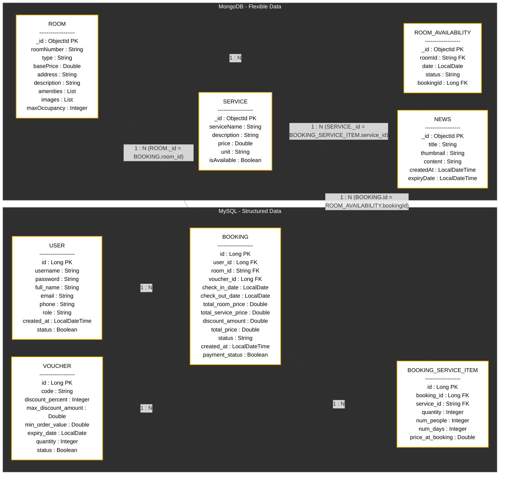

# Hotel Booking System ERD

```mermaid
flowchart LR

%% =====================================================
%% MYSQL DATABASE
%% =====================================================

subgraph MYSQL["MySQL - Structured Data"]

USER["USER
-------------------
id : Long PK
username : String
password : String
full_name : String
email : String
phone : String
role : String
created_at : LocalDateTime
status : Boolean"]

BOOKING["BOOKING
-------------------
id : Long PK
user_id : Long FK
room_id : String FK
voucher_id : Long FK
check_in_date : LocalDate
check_out_date : LocalDate
total_room_price : Double
total_service_price : Double
discount_amount : Double
total_price : Double
status : String
created_at : LocalDateTime
payment_status : Boolean"]

BOOKING_SERVICE_ITEM["BOOKING_SERVICE_ITEM
-------------------
id : Long PK
booking_id : Long FK
service_id : String FK
quantity : Integer
num_people : Integer
num_days : Integer
price_at_booking : Double"]

VOUCHER["VOUCHER
-------------------
id : Long PK
code : String
discount_percent : Integer
max_discount_amount : Double
min_order_value : Double
expiry_date : LocalDate
quantity : Integer
status : Boolean"]

end

%% =====================================================
%% MONGODB DATABASE
%% =====================================================

subgraph MONGODB["MongoDB - Flexible Data"]

ROOM["ROOM
-------------------
_id : ObjectId PK
roomNumber : String
type : String
basePrice : Double
address : String
description : String
amenities : List<String>
images : List<String>
maxOccupancy : Integer"]

SERVICE["SERVICE
-------------------
_id : ObjectId PK
serviceName : String
description : String
price : Double
unit : String
isAvailable : Boolean"]

ROOM_AVAILABILITY["ROOM_AVAILABILITY
-------------------
_id : ObjectId PK
roomId : String FK
date : LocalDate
status : String
bookingId : Long FK"]

NEWS["NEWS
-------------------
_id : ObjectId PK
title : String
thumbnail : String
content : String
createdAt : LocalDateTime
expiryDate : LocalDateTime"]

end

%% =====================================================
%% RELATIONSHIPS
%% =====================================================

USER -- "1 : N" --> BOOKING

VOUCHER -- "1 : N" --> BOOKING

BOOKING -- "1 : N" --> BOOKING_SERVICE_ITEM

ROOM -- "1 : N" --> ROOM_AVAILABILITY

ROOM -. "1 : N (ROOM._id = BOOKING.room_id)" .-> BOOKING

SERVICE -. "1 : N (SERVICE._id = BOOKING_SERVICE_ITEM.service_id)" .-> BOOKING_SERVICE_ITEM

BOOKING -. "1 : N (BOOKING.id = ROOM_AVAILABILITY.bookingId)" .-> ROOM_AVAILABILITY

%% =====================================================
%% STYLE
%% =====================================================

style USER fill:#ffffff,stroke:#f4b400,stroke-width:2px,color:#000
style BOOKING fill:#ffffff,stroke:#f4b400,stroke-width:2px,color:#000
style BOOKING_SERVICE_ITEM fill:#ffffff,stroke:#f4b400,stroke-width:2px,color:#000
style VOUCHER fill:#ffffff,stroke:#f4b400,stroke-width:2px,color:#000

style ROOM fill:#ffffff,stroke:#f4b400,stroke-width:2px,color:#000
style SERVICE fill:#ffffff,stroke:#f4b400,stroke-width:2px,color:#000
style ROOM_AVAILABILITY fill:#ffffff,stroke:#f4b400,stroke-width:2px,color:#000
style NEWS fill:#ffffff,stroke:#f4b400,stroke-width:2px,color:#000

style MYSQL fill:#2f2f2f,stroke:#999,color:#fff
style MONGODB fill:#2f2f2f,stroke:#999,color:#fff

```